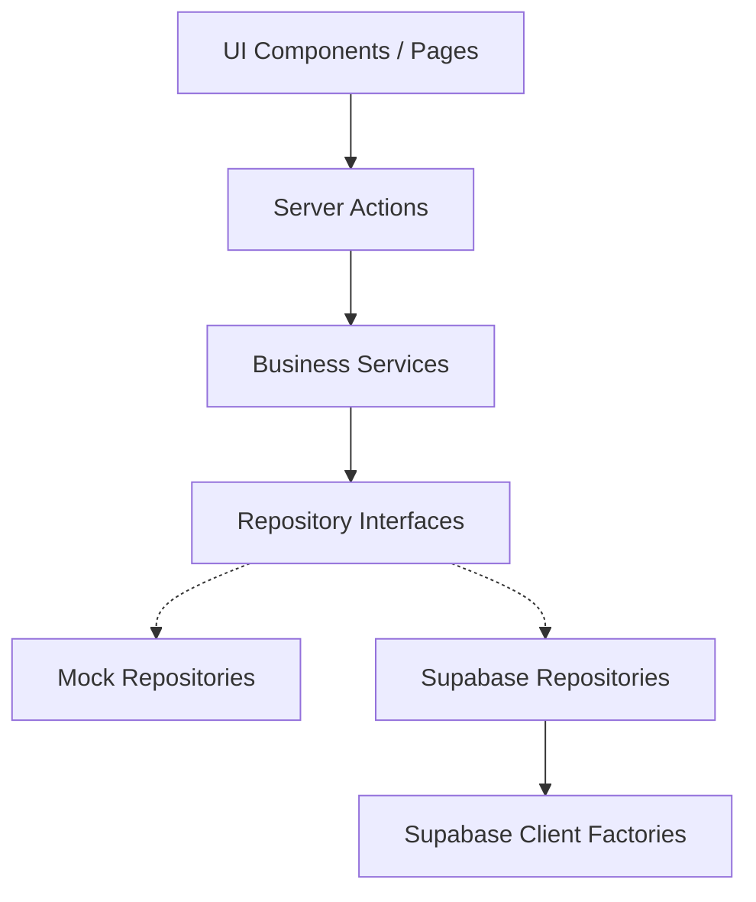

# CloudCinema Backend Architecture

This document describes the backend architecture of CloudCinema (Epic 1, Micro Phase 1.1), focusing on decoupled repositories, clients, validation helpers, and error integrations.

---

## 1. Repository Pattern

All data access is abstracted behind formal contracts (interfaces) located in `src/repositories/`. No direct database queries or API fetches exist in components or server actions.

### Repository Contracts

* **`AuthRepository`** (`src/repositories/auth/`): Handles logins, sessions, and sign outs.
* **`MediaRepository`** (`src/repositories/media/`): Handles queries for movies, TV shows, anime, and detail listings.
* **`ProgressRepository`** (`src/repositories/progress/`): Handles user watch position bookmarks and status tracking.
* **`MetadataRepository`** (`src/repositories/metadata/`): Handles TMDB mappings and external content indexes.

By adhering to repositories, we can switch the backing implementation (e.g. from local mocks to Supabase or custom APIs) without refactoring UI controllers or layouts.

---

## 2. Client Layer

The client layer (`src/clients/`) encapsulates database and external API client builders.

### Supabase Client Factories

* **Browser Client** (`src/clients/supabase/browser.ts`): Initializes standard clients for React client-side pages and components.
* **Server Client** (`src/clients/supabase/server.ts`): Syncs cookies dynamically to Next.js server actions, loaders, and route handlers.
* **Middleware Client** (`src/clients/supabase/middleware.ts`): Refreshes tokens and updates request/response cookies at the edge.

These clients load credentials from the validation layer (`src/config/env.ts`) and throw a typed `AppError` on configuration errors instead of crashing during static builds.

---

## 3. Validation Layer

The validation layer (`src/schemas/`) hosts standard Zod runtime schemas to enforce boundary constraints.

### Shared Schemas (`src/schemas/shared.ts`)

* `uuidSchema`: Standard format checks for database identifiers.
* `emailSchema`: Standard syntax checks for user addresses.
* `urlSchema`: Validates remote links.
* `paginationQuerySchema`: Normalizes search index query offsets.

---

## 4. Server Layer

Located inside `src/server/`, this layer acts as the orchestrator of server actions and business services.

* **Server Actions** (`src/server/actions/`): Secure client-callable entry points.
* **Business Services** (`src/server/services/`): Processes data logic (e.g. syncing file structures).
* **Validation Middleware** (`src/server/validation/`): Server-side validation rules.

---

## 5. Dependency Flow

The architecture follows a strict unidirectional dependency structure:

At no point do UI views or page layout nodes communicate directly with the Client Layer or import database SDKs.

---

## 6. Future Supabase Integration

When we connect to Supabase, we will:
1. Define Supabase-backed repository classes implementing our repository interfaces.
2. Inject the Supabase repositories into our services.
3. Keep the UI layouts completely unchanged.
