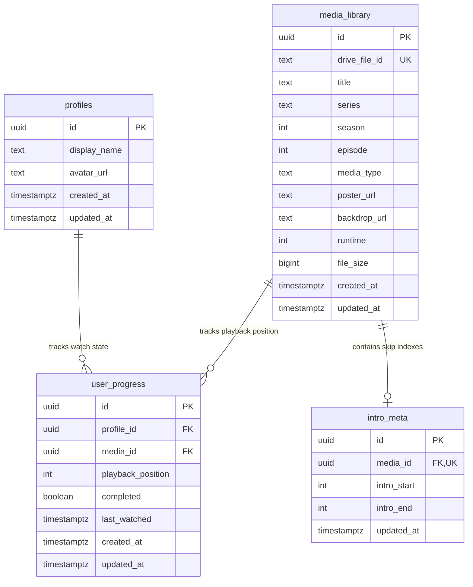

# CloudCinema Database Schema Guide

This document describes the database schema configuration and migrations for CloudCinema (Epic 2, Phase 2.1).

---

## 1. Entity Relationship Diagram (ERD)

The database schema manages user profiles, media catalog indexes, intro/skip metadata, and user watch positions.



---

## 2. Table Specifications

### `profiles`
Tracks app user accounts synced from Supabase Auth (`auth.users`).
* `id` (UUID): Primary key, foreign key references `auth.users(id)` on delete cascade.
* `display_name` (Text): Public name of the user.
* `avatar_url` (Text): Link to profile picture.
* `created_at` (Timestamptz): Default `now()`.
* `updated_at` (Timestamptz): Default `now()`.

### `media_library`
Stores movie, show, anime catalog parameters.
* `id` (UUID): Primary key, default `gen_random_uuid()`.
* `drive_file_id` (Text): Unique ID matching Google Drive file identifiers.
* `title` (Text): Visual title.
* `series` (Text): Name of parent series (null for standalone movies).
* `season` (Int): TV show season index.
* `episode` (Int): Episode number.
* `media_type` (Text): Catalog discriminator (`'movie'`, `'tv-show'`, or `'anime'`).
* `poster_url` / `backdrop_url` (Text): TMDB visual links.
* `runtime` (Int): Length of file in seconds.
* `file_size` (Bigint): File size in bytes.

### `user_progress`
Bookmarks watch progress markers.
* `id` (UUID): Primary key.
* `profile_id` (UUID): Foreign key references `profiles(id)` on delete cascade.
* `media_id` (UUID): Foreign key references `media_library(id)` on delete cascade.
* `playback_position` (Int): Current progress in seconds.
* `completed` (Boolean): Boolean flag indicating if media has been watched.
* Unique Constraint: `(profile_id, media_id)` ensures only one bookmark exists per media item per user.

### `intro_meta`
Skip timestamps for episodic intros.
* `id` (UUID): Primary key.
* `media_id` (UUID): Unique foreign key references `media_library(id)` on delete cascade.
* `intro_start` (Int): Start time in seconds.
* `intro_end` (Int): End time in seconds.

---

## 3. Indexes & Constraints

* **`media_library`**:
  * Unique index `media_library_drive_file_id_idx` on `drive_file_id` to prevent duplicate indexing.
  * Index `media_library_media_type_idx` on `media_type` to optimize catalog loads.
* **`user_progress`**:
  * Unique constraint `user_progress_profile_media_unique` on `(profile_id, media_id)`.
  * Index `user_progress_profile_id_idx` on `profile_id`.
  * Index `user_progress_media_id_idx` on `media_id`.
* **`intro_meta`**:
  * Unique constraint and index `intro_meta_media_id_idx` on `media_id` for fast skip checks.

---

## 4. Row Level Security (RLS) Strategy

RLS is enabled on all tables:
* **`profiles`**:
  * Select: Authenticated users can query all profiles to support screen-switching.
  * Update: Users can modify ONLY their own profile (`auth.uid() = id`).
* **`media_library`**:
  * Select: Read-only access allowed for authenticated users.
  * Write: `service_role` only (write access is handled by back-office syncing scripts).
* **`user_progress`**:
  * Select/Insert/Update/Delete: Restricted strictly to the profile owner (`auth.uid() = profile_id`).
* **`intro_meta`**:
  * Select: Read-only access allowed for authenticated users.
  * Write: `service_role` only.

---

## 5. Migration & Syncing Workflow

1. **Creating Migrations**:
   Run the CLI command:
   ```bash
   npx supabase migration new <name>
   ```
2. **Applying Migrations**:
   To apply migrations locally (requires Docker):
   ```bash
   npx supabase start
   ```
3. **Database Syncing Triggers**:
   * Triggers are configured to auto-invoke `handle_updated_at()` and update the `updated_at` column values on change.
   * A trigger automatically handles new sign-ups inside `auth.users`, duplicating identifiers into the public `profiles` table to bootstrap profiles.
